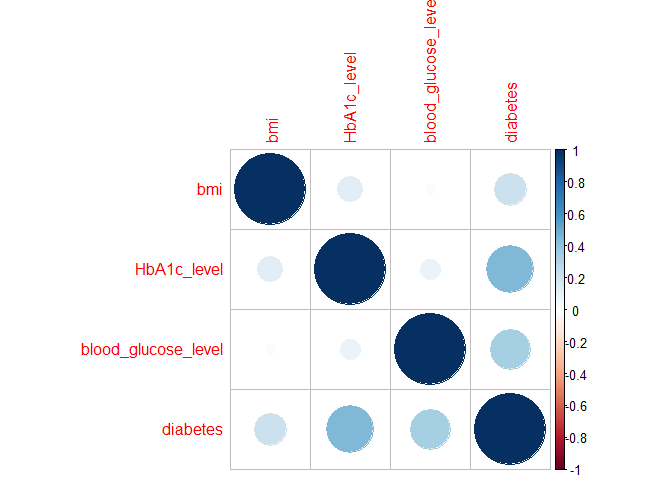

## R Markdown

This is an R Markdown document. Markdown is a simple formatting syntax
for authoring HTML, PDF, and MS Word documents. For more details on
using R Markdown see <http://rmarkdown.rstudio.com>.

When you click the **Knit** button a document will be generated that
includes both content as well as the output of any embedded R code
chunks within the document. You can embed an R code chunk like this:

DESCRIPTIVE STATISTICS

    library(readr)
    library(mice)

    ## 
    ## Attaching package: 'mice'

    ## The following object is masked from 'package:stats':
    ## 
    ##     filter

    ## The following objects are masked from 'package:base':
    ## 
    ##     cbind, rbind

    library(readxl)
    diabetes_prediction_dataset <- read_excel("C:/Users/User/github-classroom/BIProject/data/diabetes_prediction_dataset.xlsx")

    dim(diabetes_prediction_dataset)

    ## [1] 1000    9

    sapply(diabetes_prediction_dataset, class)

    ##              gender                 age        hypertension       heart_disease 
    ##         "character"           "numeric"           "numeric"           "numeric" 
    ##     smoking_history                 bmi         HbA1c_level blood_glucose_level 
    ##         "character"           "numeric"           "numeric"           "numeric" 
    ##            diabetes 
    ##           "numeric"

    diabetes_prediction_frequencies <- table(diabetes_prediction_dataset$gender)

    diabetes_prediction_dataset_freq <- diabetes_prediction_dataset$smoking_history
    cbind(frequency = table(diabetes_prediction_dataset_freq),
          percentage = prop.table(table(diabetes_prediction_dataset_freq)) * 100)

    ##             frequency percentage
    ## current            82        8.2
    ## ever               44        4.4
    ## former             89        8.9
    ## never             372       37.2
    ## No Info           351       35.1
    ## not current        62        6.2

    diabetes_prediction_dataset_mode <- names(table(diabetes_prediction_dataset$gender))[
      which(table(diabetes_prediction_dataset$gender) ==
              max(table(diabetes_prediction_dataset$gender)))
    ]
    print(diabetes_prediction_dataset_mode)

    ## [1] "Female"

    summary(diabetes_prediction_dataset)

    ##     gender               age         hypertension   heart_disease  
    ##  Length:1000        Min.   : 0.08   Min.   :0.000   Min.   :0.000  
    ##  Class :character   1st Qu.:22.75   1st Qu.:0.000   1st Qu.:0.000  
    ##  Mode  :character   Median :42.00   Median :0.000   Median :0.000  
    ##                     Mean   :41.27   Mean   :0.068   Mean   :0.032  
    ##                     3rd Qu.:59.00   3rd Qu.:0.000   3rd Qu.:0.000  
    ##                     Max.   :80.00   Max.   :1.000   Max.   :1.000  
    ##  smoking_history         bmi         HbA1c_level    blood_glucose_level
    ##  Length:1000        Min.   :10.30   Min.   :3.500   Min.   : 80.0      
    ##  Class :character   1st Qu.:22.95   1st Qu.:4.800   1st Qu.:100.0      
    ##  Mode  :character   Median :27.32   Median :5.800   Median :145.0      
    ##                     Mean   :26.96   Mean   :5.559   Mean   :138.4      
    ##                     3rd Qu.:29.07   3rd Qu.:6.200   3rd Qu.:159.0      
    ##                     Max.   :69.37   Max.   :9.000   Max.   :300.0      
    ##     diabetes    
    ##  Min.   :0.000  
    ##  1st Qu.:0.000  
    ##  Median :0.000  
    ##  Mean   :0.082  
    ##  3rd Qu.:0.000  
    ##  Max.   :1.000

    sapply(diabetes_prediction_dataset[, c(2, 3, 6, 7, 8, 9)], sd)

    ##                 age        hypertension                 bmi         HbA1c_level 
    ##          22.9096190           0.2518719           6.7862044           1.0984791 
    ## blood_glucose_level            diabetes 
    ##          38.7036356           0.2745020

    sapply(diabetes_prediction_dataset[, c(2, 3, 6, 7, 8, 9)], var)

    ##                 age        hypertension                 bmi         HbA1c_level 
    ##        5.248506e+02        6.343944e-02        4.605257e+01        1.206656e+00 
    ## blood_glucose_level            diabetes 
    ##        1.497971e+03        7.535135e-02

    library(e1071)

    sapply(diabetes_prediction_dataset[, 6:9],  kurtosis, type = 2)

    ##                 bmi         HbA1c_level blood_glucose_level            diabetes 
    ##           4.0923202           0.4047459           1.5662812           7.3270244

    sapply(diabetes_prediction_dataset[, 6:9],  skewness, type = 2)

    ##                 bmi         HbA1c_level blood_glucose_level            diabetes 
    ##          1.19328415         -0.02172996          0.63922614          3.05161832

STATISTICAL TEST ANOVA

    diabetes_prediction_dataset_one_way_anova <- aov(age ~ diabetes, data = diabetes_prediction_dataset)
    summary(diabetes_prediction_dataset_one_way_anova)

    ##              Df Sum Sq Mean Sq F value   Pr(>F)    
    ## diabetes      1  29002   29002   58.44 4.92e-14 ***
    ## Residuals   998 495323     496                     
    ## ---
    ## Signif. codes:  0 '***' 0.001 '**' 0.01 '*' 0.05 '.' 0.1 ' ' 1

UNVARIATE AND MULTIVARIATE PLOTS

    library(corrplot)

    ## corrplot 0.92 loaded

    corrplot(cor(diabetes_prediction_dataset[, 6:9]), method = "circle")

MISSING VALUES, DATA IMPUTATION AND DATA TRANSFORMATION

    library(dplyr)

    ## 
    ## Attaching package: 'dplyr'

    ## The following objects are masked from 'package:stats':
    ## 
    ##     filter, lag

    ## The following objects are masked from 'package:base':
    ## 
    ##     intersect, setdiff, setequal, union

    any(is.na(diabetes_prediction_dataset))

    ## [1] FALSE

TRAINING THE MODEL

    library(caret)

    ## Loading required package: ggplot2

    ## Loading required package: lattice

    train_index <- createDataPartition(diabetes_prediction_dataset$gender,
                                       p = 0.75,
                                       list = FALSE)
    diabetes_prediction_dataset_train <- diabetes_prediction_dataset[train_index, ]
    diabetes_prediction_dataset_test <- diabetes_prediction_dataset[-train_index, ]

    train_control <- trainControl(method = "cv", number = 5)

    diabetes_prediction_dateset_model_lda <-
      caret::train(`gender` ~ ., data = diabetes_prediction_dataset_train,
                   trControl = train_control, na.action = na.omit, method = "lda2",
                   metric = "Accuracy")

    str(diabetes_prediction_dataset$diabetes)

    ##  num [1:1000] 0 0 0 0 0 0 1 0 0 0 ...

    diabetes_prediction_dataset$diabetes <- as.factor(diabetes_prediction_dataset$diabetes)

    set.seed(123)

    library(caret)

    train_control <- trainControl(method = "cv",
                                  number = 10,
                                  search = "grid",
                                  classProbs = TRUE,
                                  summaryFunction = multiClassSummary)

    library(randomForest)

    ## randomForest 4.7-1.1

    ## Type rfNews() to see new features/changes/bug fixes.

    ## 
    ## Attaching package: 'randomForest'

    ## The following object is masked from 'package:ggplot2':
    ## 
    ##     margin

    ## The following object is masked from 'package:dplyr':
    ## 
    ##     combine

    library(MLmetrics)

    ## 
    ## Attaching package: 'MLmetrics'

    ## The following objects are masked from 'package:caret':
    ## 
    ##     MAE, RMSE

    ## The following object is masked from 'package:base':
    ## 
    ##     Recall

    rf_model <- train(gender~ ., data = diabetes_prediction_dataset_train, method = "rf", trControl = train_control)

    predictions <- predict(rf_model, newdata = diabetes_prediction_dataset_test)

    library(e1071)
    svm_model <- train(gender ~ ., data = diabetes_prediction_dataset_train, method = "svmRadial", trControl = train_control)

    ## Warning in nominalTrainWorkflow(x = x, y = y, wts = weights, info = trainInfo,
    ## : There were missing values in resampled performance measures.

    train_control <- trainControl(method = "cv", number = 10)  

    models_list <- list(
      Random_Forest = rf_model,
      SVM = svm_model
    )

    results <- resamples(models_list, control = train_control)

    summary(results)

    ## 
    ## Call:
    ## summary.resamples(object = results)
    ## 
    ## Models: Random_Forest, SVM 
    ## Number of resamples: 10 
    ## 
    ## Accuracy 
    ##                    Min.   1st Qu.    Median      Mean   3rd Qu.      Max. NA's
    ## Random_Forest 0.5466667 0.5766667 0.6160526 0.6193390 0.6599550 0.7066667    0
    ## SVM           0.5540541 0.5940789 0.6000000 0.6083703 0.6233333 0.6842105    0
    ## 
    ## AUC 
    ##                    Min.   1st Qu.    Median      Mean   3rd Qu.      Max. NA's
    ## Random_Forest 0.5121864 0.5456297 0.6123534 0.6035309 0.6593200 0.6807185    0
    ## SVM           0.3856061 0.5549853 0.5659824 0.5775798 0.6427786 0.7010753    0
    ## 
    ## Balanced_Accuracy 
    ##                    Min.   1st Qu.    Median      Mean   3rd Qu.      Max. NA's
    ## Random_Forest 0.4849707 0.5248350 0.5617343 0.5627362 0.5969758 0.6499267    0
    ## SVM           0.4871212 0.5214687 0.5304252 0.5426434 0.5610337 0.6179211    0
    ## 
    ## Detection_Rate 
    ##                    Min.   1st Qu.    Median      Mean   3rd Qu.      Max. NA's
    ## Random_Forest 0.4605263 0.4933333 0.5100000 0.5194580 0.5585135 0.5733333    0
    ## SVM           0.5000000 0.5233333 0.5364035 0.5378421 0.5566667 0.5789474    0
    ## 
    ## F1 
    ##                    Min.   1st Qu.    Median      Mean   3rd Qu.      Max. NA's
    ## Random_Forest 0.6796117 0.6954212 0.7265688 0.7311934 0.7656754 0.7962963    0
    ## SVM           0.6915888 0.7260660 0.7298706 0.7329840 0.7368421 0.7857143    0
    ## 
    ## Kappa 
    ##                      Min.    1st Qu.     Median       Mean   3rd Qu.      Max.
    ## Random_Forest -0.03322528 0.05386347 0.13453209 0.13842920 0.2159119 0.3314425
    ## SVM           -0.02864364 0.04868001 0.06860074 0.09504941 0.1358712 0.2651088
    ##               NA's
    ## Random_Forest    0
    ## SVM              0
    ## 
    ## logLoss 
    ##                    Min.   1st Qu.    Median      Mean   3rd Qu.      Max. NA's
    ## Random_Forest 0.6594471 0.6657036 0.7176971 0.7209824 0.7675825 0.8072062    0
    ## SVM           0.6290935 0.6643144 0.6678590 0.6681673 0.6711633 0.7158972    0
    ## 
    ## Neg_Pred_Value 
    ##                    Min.   1st Qu.    Median      Mean   3rd Qu.      Max. NA's
    ## Random_Forest 0.3636364 0.4750000 0.5714286 0.6131746 0.7651515 0.9090909    0
    ## SVM           0.3636364 0.5138889 0.5916667 0.5858081 0.6000000 0.8888889    0
    ## 
    ## Pos_Pred_Value 
    ##                    Min.   1st Qu.    Median      Mean   3rd Qu.      Max. NA's
    ## Random_Forest 0.5781250 0.6042256 0.6246334 0.6245564 0.6444515 0.6718750    0
    ## SVM           0.5873016 0.6000000 0.6045009 0.6123628 0.6206710 0.6567164    0
    ## 
    ## prAUC 
    ##                    Min.   1st Qu.    Median      Mean   3rd Qu.      Max. NA's
    ## Random_Forest 0.4982118 0.5359260 0.5888811 0.5838022 0.6321174 0.6491139    0
    ## SVM           0.4270120 0.5337127 0.5504442 0.5639660 0.6070329 0.6798609    0
    ## 
    ## Precision 
    ##                    Min.   1st Qu.    Median      Mean   3rd Qu.      Max. NA's
    ## Random_Forest 0.5781250 0.6042256 0.6246334 0.6245564 0.6444515 0.6718750    0
    ## SVM           0.5873016 0.6000000 0.6045009 0.6123628 0.6206710 0.6567164    0
    ## 
    ## Recall 
    ##                    Min.   1st Qu.   Median      Mean   3rd Qu.      Max. NA's
    ## Random_Forest 0.7777778 0.8409091 0.865404 0.8826768 0.9488636 0.9772727    0
    ## SVM           0.8409091 0.8920455 0.910101 0.9138889 0.9488636 0.9777778    0
    ## 
    ## Sensitivity 
    ##                    Min.   1st Qu.   Median      Mean   3rd Qu.      Max. NA's
    ## Random_Forest 0.7777778 0.8409091 0.865404 0.8826768 0.9488636 0.9772727    0
    ## SVM           0.8409091 0.8920455 0.910101 0.9138889 0.9488636 0.9777778    0
    ## 
    ## Specificity 
    ##                     Min.   1st Qu.    Median      Mean   3rd Qu.      Max. NA's
    ## Random_Forest 0.12903226 0.2258065 0.2419355 0.2427957 0.2645161 0.3225806    0
    ## SVM           0.09677419 0.1290323 0.1473118 0.1713978 0.2177419 0.2903226    0

HYPER-PARAMETER TUNING AND ENSEMBLES

    library(caret)
    library(randomForest)

    grid <- expand.grid(mtry = c(2, 4, 6, 8, 10)) 

    control <- trainControl(method = "cv", number = 5) 

    model_grid_search <- train(gender ~ ., data = diabetes_prediction_dataset_train, method = "rf",
                               trControl = control, tuneGrid = grid)
